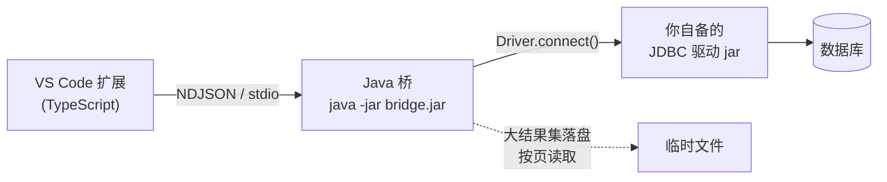

# Open DB Client

[](https://github.com/livebug/open-dbclient/actions/workflows/ci.yml)
[](https://github.com/livebug/open-dbclient/actions/workflows/release.yml)
[](LICENSE)
[](https://code.visualstudio.com/)

> A universal JDBC database client for VS Code: connect, SQL completion, execute, export, table
> structure and JDBC-level health monitoring — without being tied to any particular database.

用 JDBC 连接**任意**数据库的 VS Code 客户端:连接、SQL 智能补全、执行、导出、表结构、健康监控。

它**不绑定任何数据库**:不写 `if (mysql) ... else if (oracle) ...`,只走 JDBC 标准 API 加能力探测。
驱动由你自己提供,想连什么就放什么 jar。



---

## 目录

- [环境要求](#环境要求)
- [安装](#安装)
- [准备 JDBC 驱动](#准备-jdbc-驱动)
- [快速上手](#快速上手)
- [功能详解](#功能详解)
- [命令与快捷键](#命令与快捷键)
- [配置项](#配置项)
- [架构与设计取舍](#架构与设计取舍)
- [安全说明](#安全说明)
- [从源码开发](#从源码开发)
- [已知限制](#已知限制)
- [发布流程](#发布流程)
- [许可](#许可)

---

## 环境要求

| 项目 | 要求 | 说明 |
|---|---|---|
| VS Code | **1.90.0** 或更高 | |
| JDK | **17** 或更高 | 只需要 JRE 能跑 `java` 即可;桥本身零外部依赖 |

扩展会在启动桥时自动寻找 `java`。如果 PATH 里没有,或者要用指定版本,请设置
`open-dbclient.javaHome` 或 `JAVA_HOME`。

---

## 安装

### 方式一:从 GitHub Release 下载(推荐)

1. 打开 [Releases](https://github.com/livebug/open-dbclient/releases) 页面
2. 下载最新的 `open-dbclient-<版本>.vsix`
3. 在 VS Code 中按 `Ctrl+Shift+P` → **Extensions: Install from VSIX...** → 选择该文件

命令行等价写法:

```
code --install-extension open-dbclient-<版本>.vsix
```

### 方式二:从源码构建安装

见[从源码开发](#从源码开发)。

> 本扩展尚未发布到 VS Code 应用市场,请使用上面两种方式之一。

---

## 准备 JDBC 驱动

**本扩展不含任何驱动 jar。** 请通过以下任一方式提供:

### 方式一:从 Maven Central 下载(最省事)

`Ctrl+Shift+P` → **DB Client: Download Driver from Maven Central...**,然后按
`groupId:artifactId:version` 输入坐标,例如:

```
org.postgresql:postgresql:42.7.4
com.mysql:mysql-connector-j:9.1.0
org.xerial:sqlite-jdbc:3.47.1.0
com.microsoft.sqlserver:mssql-jdbc:12.8.1.jre11
```

### 方式二:添加本地 jar

`Ctrl+Shift+P` → **DB Client: Add Driver Jar...**,选中的 jar 会被复制到扩展的驱动目录。

### 方式三:直接丢进驱动目录

`Ctrl+Shift+P` → **DB Client: Open Driver Folder**,把 jar 拷进去,然后
**DB Client: Restart JDBC Bridge**(或重载窗口)。

### 方式四:用设置指向已有目录

不想复制文件的话,在 `settings.json` 里直接指向现有目录:

```jsonc
{
  // 目录或单个 jar 文件,支持 ~ 开头,最多 200 个
  "open-dbclient.driverPaths": ["~/jdbc-drivers", "/opt/vendor/lib/foo-driver.jar"],

  // 可选:明确指定驱动类名。一般不需要,扩展会从 jar 里读 META-INF/services/java.sql.Driver
  "open-dbclient.driverClassNames": ["com.vendor.jdbc.Driver"]
}
```

加载了哪些驱动可以用 **DB Client: List Loaded Drivers** 查看。

---

## 快速上手

### 1. 建一个连接

点活动栏的 **Open DB Client** 图标 → 点 **Connections** 视图标题栏的 `+`,打开单页表单:

| 字段 | 说明 |
|---|---|
| **Driver** | 从已加载的驱动里选;驱动 jar 还没放时会有提示入口 |
| **Name** | 自己起一个好记的名字 |
| **JDBC URL** | 选中驱动后自动预填前缀,可直接改 |
| **User** | 留空表示 URL 里已带凭据 |
| **Password** | 存入 VS Code 加密的 `SecretStorage`,不落明文 |
| **Properties** | 额外 JDBC 参数,格式 `key=value;key=value` |

**必须先点「Test Connection」成功后「Save」才可用** —— 这是刻意的:存一个连不上的连接,
问题要到第一次查询时才暴露。测试走桥的独立探测通道(开完就关,不进连接池),所以测一个
已经连着的连接不会干扰它。编辑已有连接时不需要重测。

模板只做两件事:预填 JDBC URL 前缀和驱动类名。它**不是方言** —— 选 MySQL 模板不等于
扩展会为 MySQL 走特殊代码路径。

### 2. 打开查询并执行

- 命令面板 → **DB Client: New Query**,或者
- 直接在任意 `.sql` 文件里用(需要先把文件关联到连接,见下)

| 快捷键 | 行为 |
|---|---|
| `Ctrl+Enter` / `Cmd+Enter` | 执行选中内容;没有选中则执行光标所在的**单条**语句;都没有则执行整个文件 |
| `Ctrl+Shift+Enter` / `Cmd+Shift+Enter` | 执行整个文件里的**所有**语句 |

每条语句上方还会有一个 **Run** 按钮(`query.codeLens`),点哪个跑哪个 —— 不用先把光标移进去。

结果出现在独立面板,默认**上下分屏**(`result.openIn`),支持分页、导出、取消、重跑。

### 3. 把 SQL 文件绑定到连接

两种方式,任选其一:

- 状态栏左下角点连接名 → 命令面板选择 **Attach This File to a Connection**
- 在文件里写一行注释指令:

```sql
-- @connection 生产库只读
-- @connection: 生产库只读    ← 两种写法都认

SELECT id, name FROM users WHERE created_at > '2026-01-01';
```

### 4. 写 SQL 时会有补全

```sql
SELECT * FROM ord|          -- 补全表名
SELECT u.|                  -- 补全 u 这个别名/表的所有列
SELECT * FROM users WHERE na|   -- 即使还没写 FROM 的表,有 alias 也能补列
INSERT INTO users (|        -- 补全列名
```

补全数据来自 JDBC 元数据,连上就自动后台预取表名(可用
`open-dbclient.intellisense.prefetchTables` 关掉)。

---

## 功能详解

### 连接管理

- 连接、断开、测试、编辑、复制、删除;密码单独存 `SecretStorage`
- 连接池:默认每连接 1 条(设 `open-dbclient.connection.poolSize` 调整)
- 重新连接同名同目标的连接会**复用**连接池,不会泄漏
- 改密码后会自动重建连接
- 数据库树按 `目录 → schema → 表/视图 → 列/索引` 展开,单层结构会自动折叠
- **筛选**:视图标题栏的筛选按钮按名称过滤表、视图、列、索引;生效时视图描述会显示
  `filter: 关键字`,避免把`过滤后的空列表`误认为`库里没东西`。清除用旁边的按钮

### SQL 智能补全

- 表名补全:`FROM` / `JOIN` / `INTO` / `UPDATE` / `USING` 之后
- 列名补全:带别名或表名限定时,只补该表的列
- 关键字与代码片段补全:`sel` `ins` `upd` `del` `joi` `cre` `wit`
- 补全逻辑跑在扩展进程内(**不走 IPC**),所以不占用每次按键的往返延迟
- 元数据按需加载并做 LRU 缓存(`intellisense.columnCacheLimit`)

### 脚本参数(变量)

脚本里的 `${名字}` 会被当作参数。打开含参数的脚本时,下方会自动弹出参数面板 —— 支持随便改,
行得通再执行:

```sql
SELECT * FROM orders
WHERE created_at >= ${V_DATE}
  AND status = ${V_STATUS};
```

- 变量样式可自定义:设置 `variables.pattern` 为正则(**需带一个捕获组**作为变量名)。不写捕获组
  时整个匹配当作变量名
- 变量值按**工作区**保存,同一个 `${V_DATE}` 在各脚本里含义一致
- 执行前替换;有**任何一个变量没填值就拒绝执行**并提示是哪个 —— 把 `> ${V_DATE}` 换成 `> `
  比直接报错更危险
- 想改用 `:V_DATE` 这种风格,把 pattern 改成 `:([A-Za-z_][A-Za-z0-9_]*)` 即可

### 执行
- 支持多条语句,执行前会自动剥离注释(块注释支持嵌套)
- `INSERT`/`UPDATE`/`DELETE`/`DROP`/`TRUNCATE` 等破坏性语句默认二次确认
  (`open-dbclient.query.confirmDangerous`)
- 长查询可取消:取消按钮 + **DB Client: Cancel Running Query**
  (`Statement.cancel()` 真的会打到数据库,不是只丢结果)
- 单次查询最多取 `100000` 行,超出会被标记截断

### 结果网格

- 虚拟滚动:几十万行也不卡(界面每页 200 行,按需从磁盘拉)
- 单元格值:超过 64 KiB 截断显示;大于 2^53 的整数与 `BigDecimal` **转成字符串**避免精度丢失;
  二进制显示为 `[blob N bytes...]`
- 结果集**不经过 IPC**:桥直接落盘成临时文件,内存占用有上限
  (`open-dbclient.result.maxCacheBytes`,默认 512 MiB,SIG 会按 LRU 淘汰最旧的)

### 表结构与 DDL

- **Show Columns**: 列名、类型、长度、是否可空、默认值、注释
- **Show Indexes**: 索引名、列、是否唯一
- **Generate DDL**: 见下

#### 取 DDL 的 SQL 可以自己写(推荐)

很多数据库**本来就能直接告诉你建表语句**,而且比任何"从 JDBC 元数据重建"的结果都准 —— 重建看不到
存储子句、表空间、引擎选项,也看不到驱动报成 `OTHER` 的类型。

这些语句是方言相关的,所以由你写,插件只负责执行并把结果展示出来。设置 `open-dbclient.ddl.queries`:

```jsonc
"open-dbclient.ddl.queries": [
  // 第一条匹配连接 URL 的规则生效;* 匹配任意字符,整条 URL 必须匹配
  { "id": "hive",   "match": "jdbc:hive2:*",      "sql": "DESC ${qualified}" },
  { "id": "pgsql",  "match": "jdbc:postgresql:*", "sql": "SELECT pg_get_tabledef('${qualified}')" },
  { "id": "mysql",  "match": "jdbc:mysql:*",      "sql": "SHOW CREATE TABLE ${quotedQualified}" },
  { "id": "oracle", "match": "jdbc:oracle:*",     "sql": "SELECT DBMS_METADATA.GET_DDL('TABLE', '${table}') FROM DUAL" },

  // 没有 match 的规则匹配一切,放最后当兜底
  { "id": "fallback", "sql": "SELECT 1" }
]
```

**没有规则匹配时,才用内置的元数据重建**,所以默认行为不变。

占位符分两种 —— 这个区分很关键:

| 用途 | 写法 | 展开成 |
|---|---|---|
| 字符串字面量里 / Hive 的 `DESC` 后 | `${table}` `${schema}` `${catalog}` `${qualified}` `${column}` | 驱动上报的**原始名字**,不加引号 |
| 需要标识符的位置 | `${quotedTable}` `${quotedSchema}` `${quotedCatalog}` `${quotedQualified}` `${quotedColumn}` | 用数据库上报的引号字符包裹 |

搞反了的后果:`pg_get_tabledef('${quotedQualified}')` 会去找一张**名字里带引号**的表,不报语法错,只是找不到。
`${qualified}` 在没有 schema 的库上不会产生开头的点(`DESC .table` 那种)。

结果的展示方式:数据库返回**一个单元格**就打开成文本(PostgreSQL 那种一长串 `CREATE TABLE` 在网格单元里
得双击才能看),否则开结果网格(`DESC` 返回的是多行多列)。文本里会带上实际执行的 SQL,便于回溯是哪条规则生效了。

#### 内置生成器的风格选项

不写规则时用内置重建,它的**格式**可配:`ddl.ifNotExists`、`ddl.indent`、`ddl.includeIndexes`、
`ddl.quoteIdentifiers`。有规则匹配时这些设置不生效。

刻意**不**开放的是"语句怎么从元数据推导":物理存储子句、表空间、引擎选项在 JDBC 元数据里根本拿不到,
提供"自定义"只会是假的 —— 这也是上面那套自定义 SQL 存在的理由。

### 自定义动作

树上右键(或节点上的▸图标)可以跑你自己定义的 SQL。设置 `open-dbclient.actions` 里写一条就多一个动作:

```jsonc
"open-dbclient.actions": [
  {
    "id": "count",
    "label": "统计行数",
    "icon": "$(list-ordered)",
    "appliesTo": ["table", "view"],
    "sql": "SELECT COUNT(*) FROM ${quotedQualified}"
  },
  {
    "id": "recent",
    "label": "最近 7 天",
    "appliesTo": ["table"],
    "sql": "SELECT * FROM ${quotedQualified} ORDER BY ${quotedColumn} DESC"
  }
]
```

占位符与 DDL 查询**完全一致**(原始名 / 加引号名两套),见上面的表。

三个细节是刻意的:

- **填不上的占位符会阻止动作,而不是变成空**。`LIKE '%${column}%'` 展开成 `LIKE '%%'` 会静默匹配所有行,
  比直接拒绝危险得多
- **语句会在一个已绑定连接的编辑器里打开,而不是静默执行**。这样你能看到跑的是什么、改完再跑
- **没有 `appliesTo` 的动作在所有节点上出现**;写了就只在列出的类型上出现

> VS Code 的右键菜单是**静态**的,扩展不能动态往里塞 N 个按钮。所以自定义动作统一走这个入口;
> 只有一个动作时直接执行,多个时弹列表选。

### 导出

四种格式,不设行数上限(为了能整表导出):

| 格式 | 说明 |
|---|---|
| **CSV** | CRLF 换行,可选 UTF-8 BOM(默认开;Excel 没 BOM 时按本地码页解析,中文会乱码) |
| **JSON** | 对象数组,保留类型 |
| **Excel (.xlsx)** | 超大数据自动拆多 sheet;字符串按 inline 写入,不需要全量内存 |
| **INSERT 语句** | 可直接搬到别的库执行;数值列上为保精度而存成字符串的值会**不加引号**输出 |

两个入口:**导出查询结果**(Export Result)和**直接导出整张表**(Export Table,不用先查一遍)。
写文件失败时会删除半成品文件。

### JDBC 健康监控

状态栏实时显示桥的连接数/堆占用;点击或运行 **DB Client: Show JDBC Health** 打开
Markdown 报告,包含:

- 桥进程:JVM 堆使用、线程数、运行时长
- 连接池:每个连接的 `total / idle / checkedOut` 与借用时长
- 查询与结果:运行中查询数、缓存的结果集数量与占用、被淘汰数量
- 驱动:已加载的 jar 与驱动类

> 监控**只覆盖 JDBC 层与桥进程自身**,不含数据库服务端指标 —— 那需要各家的私有 SQL,和
> 「零方言」的前提冲突。

### 查询历史

- 每次执行都记录到 **Query History** 视图(SQL、连接、耗时、行数、成功与否)
- 保留最近 500 条,JSONL 存储
- 可插入回编辑器、单条删除、清空

---

## 命令与快捷键

按 `Ctrl+Shift+P` 输入 `DB Client` 可以看到全部命令。

| 命令 | 说明 |
|---|---|
| **连接** | |
| Add / Edit / Duplicate / Delete Connection | 增改复制删连接 |
| Test Connection | 只测连通性,不建立池 |
| Connect / Disconnect | 连接与断开 |
| Attach This File to a Connection | 把当前 SQL 文件绑到某连接 |
| **查询** | |
| New Query | 新建 SQL 编辑并绑定连接 |
| Run Query | 执行选中 / 光标处语句 / 整个文件 |
| Run This Statement | 执行指定的一条语句(每条 SQL 上方的 Run 按钮用它) |
| Run All Queries | 执行整个文件所有语句 |
| Cancel Running Query | 取消正在跑的查询 |
| Select Top 200 Rows | 从树上直接预览表数据 |
| Run Custom Action... | 在表/视图/列上跑自定义 SQL 动作 |
| Show Query Variables | 打开参数面板 |
| **导出** | |
| Export Result... | 导出当前结果网格 |
| Export Table... | 不查询,直接导出整张表 |
| **表结构** | |
| Show Columns / Show Indexes / Generate DDL | 列、索引、建表语句 |
| Copy Name | 复制节点名 |
| **驱动** | |
| Add Driver Jar... / Open Driver Folder | 添加本地驱动 |
| Download Driver from Maven Central... | 按坐标下载驱动 |
| List Loaded Drivers | 查看已加载驱动 |
| **其它** | |
| Show JDBC Health | 打开健康报告 |
| Restart JDBC Bridge | 重启 Java 桥 |
| Filter Tables and Views / Clear Table Filter | 按名称筛选或清除筛选 |
| Refresh Metadata Cache / Refresh / Refresh All | 刷新缓存与树 |
| Query History 相关 | 插入 / 删除 / 清空历史 |

快捷键:

| 快捷键 | 命令 | 生效条件 |
|---|---|---|
| `Ctrl+Enter` / `Cmd+Enter` | Run Query | SQL 文件且已绑定连接 |
| `Ctrl+Shift+Enter` / `Cmd+Shift+Enter` | Run All Queries | 同上 |

---

## 配置项

全部位于 `open-dbclient.*`。

### Java 与驱动

| 设置 | 类型 | 默认 | 说明 |
|---|---|---|---|
| `javaHome` | string | `""` | JDK 目录;留空则自动查找 |
| `javaArgs` | array | `[]` | 传给桥进程的额外 JVM 参数 |
| `jvmMaxHeap` | string | `"1g"` | 桥进程的 `-Xmx` |
| `driverPaths` | array | `[]` | 额外的驱动目录或 jar 路径 |
| `driverClassNames` | array | `[]` | 强制指定的驱动类名 |

### 连接与查询

| 设置 | 类型 | 默认 | 说明 |
|---|---|---|---|
| `connection.poolSize` | number | `1` | 每个连接的池大小 |
| `query.fetchSize` | number | `200` | JDBC fetch size |
| `query.maxRows` | number | `100000` | 每次执行的最大取数行数;`0` 表示不限。命中上限会标记为截断 |
| `query.codeLens` | boolean | `true` | 是否在每条 SQL 上方显示「Run」按钮 |
| `variables.pattern` | string | `\$\{\s*([A-Za-z_][A-Za-z0-9_]*)\s*\}` | 变量匹配正则,需带一个捕获组作为变量名 |
| `query.confirmDangerous` | boolean | `true` | 破坏性语句执行前确认 |
| `result.openIn` | string | `"below"` | 结果面板位置:`below`(上下分屏)或 `beside`(左右分屏) |
| `result.maxCacheBytes` | number | `536870912` | 磁盘结果缓存上限(512 MiB),超出按 LRU 淘汰 |

### 智能补全

| 设置 | 类型 | 默认 | 说明 |
|---|---|---|---|
| `intellisense.enabled` | boolean | `true` | 总开关 |
| `intellisense.prefetchTables` | boolean | `true` | 连接后后台预取表名 |
| `intellisense.columnCacheLimit` | number | `500` | 列信息缓存的表数量上限 |

### 健康监控

| 设置 | 类型 | 默认 | 说明 |
|---|---|---|---|
| `health.enabled` | boolean | `true` | 总开关 |
| `health.refreshInterval` | number | `2000` | 刷新间隔(毫秒,最小 500) |
| `health.showStatusBar` | boolean | `true` | 是否显示状态栏 |

### 导出与日志

| 设置 | 类型 | 默认 | 说明 |
|---|---|---|---|
| `export.csv.delimiter` | string | `","` | CSV 分隔符 |
| `export.csv.writeBom` | boolean | `true` | CSV 是否写 UTF-8 BOM |
| `export.excel.maxRowsPerSheet` | number | `1048576` | xlsx 单 sheet 行数上限 |
| `export.includeHeader` | boolean | `true` | 是否输出表头 |
| `logLevel` | string | `"info"` | 桥日志级别 |

### DDL 与自定义动作

| 设置 | 类型 | 默认 | 说明 |
|---|---|---|---|
| `ddl.queries` | array | `[]` | 自己写的取 DDL 语句,按连接 URL 匹配,见[取 DDL 的 SQL 可以自己写](#取-ddl-的-sql-可以自己写推荐) |
| `ddl.ifNotExists` | boolean | `false` | 内置生成器:生成 `CREATE TABLE IF NOT EXISTS` |
| `ddl.indent` | string | `"    "` | 内置生成器:列定义的缩进;空格、tab 或留空都行 |
| `ddl.includeIndexes` | boolean | `true` | 内置生成器:是否在表后追 `CREATE INDEX` |
| `ddl.quoteIdentifiers` | boolean | `true` | 内置生成器:标识符是否加数据库上报的引号字符 |
| `actions` | array | `[]` | 自定义 SQL 动作,见[自定义动作](#自定义动作) |

---

## 架构与设计取舍

```
VS Code 扩展进程 (TypeScript)            Java 桥进程 (零依赖)
├── 连接/查询/导出 编排                    ├── 驱动加载   (URLClassLoader)
├── 树视图、结果 webview                   ├── 连接池     (自研)
├── SQL 补全      ← 本地计算,不走 IPC      ├── 元数据读取 (DatabaseMetaData)
└── 健康监控      ←─ NDJSON over stdio ──→ ├── 查询执行   (分页/取消/落盘)
                                          ├── 导出       (CSV/JSON/SQL/XLSX)
                                          └── JMX 指标
```

**为什么用外挂 Java 进程而不是纯 Node?**

JDBC 是 Java 的东西。要在 Node 里连任意数据库,得为每个数据库引一个原生驱动包 —— 那就违背了
「驱动由用户自备、不绑定数据库」的前提。桥进程让「任意 JDBC 驱动」这件事原样成立。

**为什么桥是零依赖的?**

用户的驱动 jar 常常是含 shade 的 fat jar,自己带着一堆库。桥一旦也引入 HikariCP、POI 之类,
classpath 上的版本冲突就成了用户的问题。所以:连接池自己写,xlsx 自己写,JSON 编解码自己写。
代价是代码量,收益是 `bridge.jar` 只有约 144 KiB,且几乎不可能和任何驱动冲突。

**为什么不用方言?**

能力探测(`DatabaseMetaData.getIdentifierQuoteString()`、`supportsXxx()`)能回答绝大多数问题,
而且新数据库天然可用。方言层留到需要写数据库私有 SQL 时再说 —— 目前只有健康监控需要,而那部分
被明确划出了范围。

**其它几个取舍:**

| 决定 | 收益 | 代价 |
|---|---|---|
| 大结果集落盘、按页取,不跨 IPC | 内存不随结果集增长 | 需要临时文件与 LRU 淘汰 |
| 补全放在 TypeScript 侧 | 零 IPC 延迟 | 元数据缓存要在两边各维护一份 |
| 健康面板做成 Markdown 报告而非 webview | 白拿编辑器的选中/搜索/复制,代码量极小 | 不能画图表 |
| 连接表单用 webview 单页表单 | 能先测试再保存,URL/凭据/参数同屏可见 | 比输入框链多一份前端代码,且需要单独打包 |

---

## 安全说明

- **密码存在 VS Code 的 `SecretStorage` 里**,不写进任何配置文件
- 连接档案(主机、端口、用户名等)存在扩展的 `globalStorage` 下的 JSON 文件里
- **权限提示**:任何能写这个 JSON 文件或能调用扩展命令的人,就相当于能连你配置的那些库 ——
  请按此评估共享机器上的使用
- 与数据库之间**没有网络监听端口**,扩展与桥通过子进程 stdio 通信
- 桥进程的日志打到 stderr,不会污染协议流

---

## 从源码开发

```bash
git clone https://github.com/livebug/open-dbclient.git
cd open-dbclient
npm install
```

### 构建

```bash
npm run compile         # 打包扩展与 webview → out/extension.js, media/result/main.js
npm run bridge:compile  # 编译 Java 桥      → resources/bridge.jar
npm run icon            # 重新生成扩展图标   → media/icon/icon.png
```

### 在 VS Code 里调试

用 VS Code 打开本仓库,按 `F5` 启动「Run Extension」,会新开一个装好了本扩展的窗口。

### 测试

```bash
npm test        # 类型检查 + 文档与清单一致性 + 30 项 Java 测试 + 40 项 TS 单测(无需数据库)
npm run verify  # 上面全部 + 构建桥 + 冒烟检查
```

冒烟检查需要一个放了驱动的目录。不传目录时它会打印提示并**直接跳过**(退出码 0),
所以别把它当成跑过了 —— 想真正跑那 118 项检查要这样:

```bash
mkdir -p /tmp/dbclient-drivers && cd /tmp/dbclient-drivers
curl -O https://repo1.maven.org/maven2/org/xerial/sqlite-jdbc/3.47.1.0/sqlite-jdbc-3.47.1.0.jar
curl -O https://repo1.maven.org/maven2/org/slf4j/slf4j-api/2.0.16/slf4j-api-2.0.16.jar

cd - && npm run smoke -- /tmp/dbclient-drivers
```

这里用 Node 24 自带的 `node:sqlite` 造 fixture 库,不需要装任何数据库。

`scripts/check-docs.mjs` 会校验 README 里写的设置名、命令面板标签、快捷键、视图和链接是否
真的存在 —— 这些都是不会让构建报错、但用户一用就撞上的错误。

### 内网 / 离线开发

整个流程里**只有 `npm install` 需要联网**,其余(Java 桥构建、扩展打包、全部测试)都是本地的。
所以拿进内网只需要把 `npm ci` 需要的 tarball 带进去:

```bash
# 在有网的机器上(注意:要在与目标机器相同的 OS/CPU 架构上打)
npm run bundle:offline -- --drivers /path/to/jdbc-drivers
# → build/open-dbclient-offline-<版本>-<平台>.tar.gz,约 43 MB
```

包里有源码、npm 缓存、已构建好的产物、驱动 jar、以及一份说明。拿到内网后先跑体检,再照说明走:

```bash
node scripts/offline-doctor.mjs --cache ../npm-cache   # 检查 Node/npm/JDK 是否齐备
npm ci --offline --cache ../npm-cache
```

完整步骤、内网里哪些功能不能用(如"从 Maven Central 下载驱动")、以及二开时的注意事项,
见 **[docs/offline.md](docs/offline.md)**。

### 目录结构

```
bridge/src/main/java/com/opendbclient/bridge/
├── json/       手写 JSON 编解码(NaN、大整数、代理对都处理了)
├── rpc/        NDJSON 协议:并发派发、串行写入、取消、错误分类
├── conn/       驱动加载、连接注册表、能力探测
├── pool/       自研连接池
├── metadata/   表/列/索引读取 + DDL 生成
├── result/     值转换、结果落盘、分页
├── export/     CSV / JSON / INSERT / XLSX
├── health/     JMX 指标
└── handler/    RPC 方法实现

src/
├── bridge/     桥进程客户端(帧解析、请求关联、Java 探测、进程生命周期)
├── model/      连接档案与存储、驱动属性文本的解析
├── driver/     驱动发现/下载
├── service/    连接、元数据、导出、历史、模板、变量
├── sql/        SQL 上下文分析、补全、变量替换、code lens
├── tree/       连接树、历史树
├── webview/    结果网格、连接表单、变量面板
├── commands/   命令注册
└── util/       日志、SQL 语句切分、虚拟文档
```

---

## 已知限制

- **没有方言层**。全部走标准 JDBC;某个数据库的私有语法、私有元数据、`\d` 之类的元命令都不支持
- **健康监控不含数据库服务端指标**(连接数上限、锁等待、复制延迟等),只覆盖 JDBC 层与桥进程
- **SQL 补全不做子查询 / CTE 作用域**,别名解析只在当前语句的顶层生效
- **结果网格只读**,不能直接在网格里改数据
- **不支持 SSH 隧道**(可以用本地端口转发绕过)
- 驱动由用户自备,**扩展不校验驱动与目标数据库是否匹配**

路线图(未承诺):数据编辑、SSH 隧道、方言层、应用市场发布。

---

## 发布流程

发版是**打 tag 即自动完成**的:

```bash
# 1. 更新版本号与 CHANGELOG
npm version 0.3.0 --no-git-tag-version

# 2. 提交
git add -A && git commit -m "chore: release 0.3.0"

# 3. 打 tag 并推送 —— 这一步会触发自动发版
git tag v0.3.0
git push origin main --tags
```

推 tag 之后,`.github/workflows/release.yml` 会自动:

1. 装 Node 24 与 JDK 17
2. `npm ci` → 类型检查 → Java 单元测试 → SQL 测试
3. 构建桥与扩展,用 `vsce package` 打出 `.vsix`
4. 在 GitHub 上创建 Release,把 `open-dbclient-<版本>.vsix` 作为附件挂上去

tag 名必须是 `v` 开头的语义化版本(`v0.2.0`)。发布产物里的版本号取自
`package.json`,所以**先改 `package.json` 再打 tag**;workflow 会校验两者一致,不一致直接失败。

手动打包(本地):

```bash
npm run package                                    # 先跑测试,再打包
npm run package -- --no-verify                     # 跳过测试,只打包
# → build/open-dbclient-<版本>.vsix
```

---

## 许可

[MIT](LICENSE)
